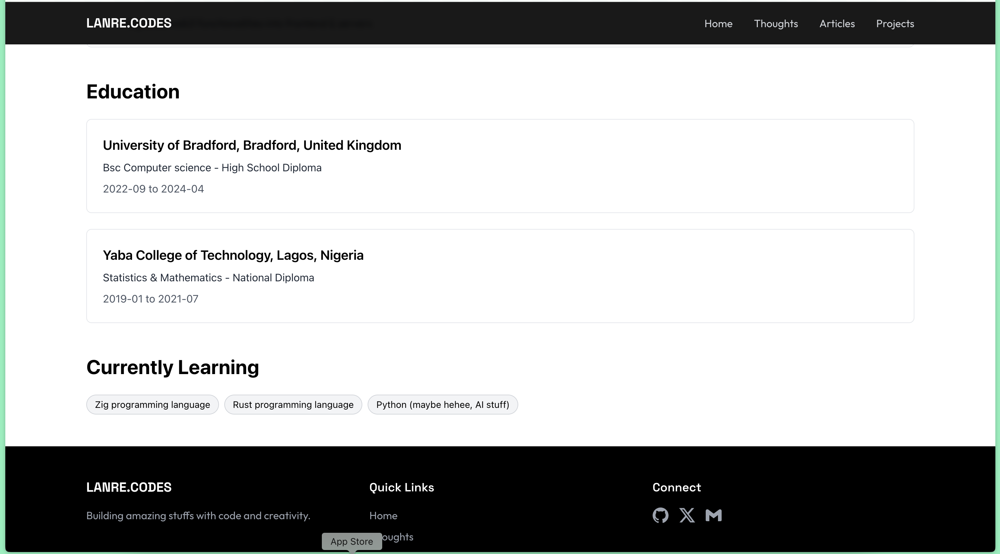

# LANRE.CODES - Portfolio Website

A modern, responsive portfolio website built with React, TypeScript, and Tailwind CSS. This project serves as both my personal portfolio and an extended version of my resume. Feel free to use it as a template for your own portfolio!




## 🚀 Features

- **Responsive Design**: Looks great on all devices
- **Dark Mode**: Sleek dark theme with modern glassmorphism effects
- **Smooth Animations**: Using Framer Motion for smooth transitions
- **SEO Optimized**: Includes meta tags and Open Graph data
- **Type Safe**: Built with TypeScript
- **Modern Stack**: React, Tailwind CSS, Framer Motion
- **Clean Architecture**: Well-organized component structure
- **Easy to Customize**: Just update the data files with your information

## 🛠️ Tech Stack

- [Vite](https://vitejs.dev/)
- [React](https://reactjs.org/)
- [TypeScript](https://www.typescriptlang.org/)
- [Tailwind CSS](https://tailwindcss.com/)
- [Framer Motion](https://www.framer.com/motion/)
- [React Router](https://reactrouter.com/)
- [React Helmet](https://github.com/nfl/react-helmet)
- [Lucide Icons](https://lucide.dev/)
- [Simple Icons](https://simpleicons.org/)

## 🚀 Quick Start

1. Clone the repository:

```bash
git clone https://github.com/lxnre-codes/your-portfolio.git
```

2. Install dependencies:

```bash
npm install
# or
yarn install
# or
bun install
```

3. Update your information:

- Edit `src/data/portfolio.ts` with your personal info
- Edit `src/utils/meta.ts` with your SEO data
- Replace `src/assets/images/profile.png` with your photo
- Replace `public/images/profile.png` with your photo
- Replace `public/*` with your favicon, social images, site.webmanifest, etc.

4. Start the development server:

```bash
npm run dev
# or
yarn dev
```

5. Build for production:

```bash
npm run build
# or
yarn build
```

## 📁 Project Structure

```
src/
├── assets/         # Static assets like images
├── components/     # React components
│   ├── Layout/     # Layout components (Navbar, Footer)
│   ├── pages/      # Page components
│   └── Portfolio/  # Portfolio components (Skills, Education)
├── data/          # Data files for portfolio content
├── types/         # TypeScript type definitions
└── utils/         # Utility functions and constants
```

## ✨ Customization

1. **Colors**: Edit the Tailwind config to change the color scheme
2. **Typography**: Update the font imports in `index.css`
3. **Content**: Modify the data files in `src/data`
4. **Layout**: Adjust components in `src/components/layout`
5. **Animations**: Edit animation variants in `src/components/utils.ts`

## 📱 Responsive Design

The portfolio is fully responsive and optimized for:

- Mobile devices (320px and up)
- Tablets (768px and up)
- Desktops (1024px and up)
- Large screens (1280px and up)

## 📄 License

This project is free for anyone to use. Feel free to fork, modify and use it for your own portfolio. All I ask is that you:

1. Give appropriate credit if you're using it as-is
2. Have fun customizing it to make it your own!

## 🤝 Contributing

Found a bug or want to contribute? Feel free to:

1. Open an issue
2. Create a pull request
3. Share your suggestions

## 📫 Contact

For any questions or suggestions, you can find me at:

- Twitter: [@lxnre_codes](https://x.com/lxnre_codes)
- GitHub: [lxnre-codes](https://github.com/lxnre-codes)
- Email: admin@lanrecodes.com

## 💖 Support

If you found this helpful, please:

1. Give it a ⭐️ on GitHub
2. Share it with others who might find it useful
3. Consider following me on Twitter/GitHub for more projects

---

Built with 💻 by [Lanre Popoola](https://lanrecodes.com)
